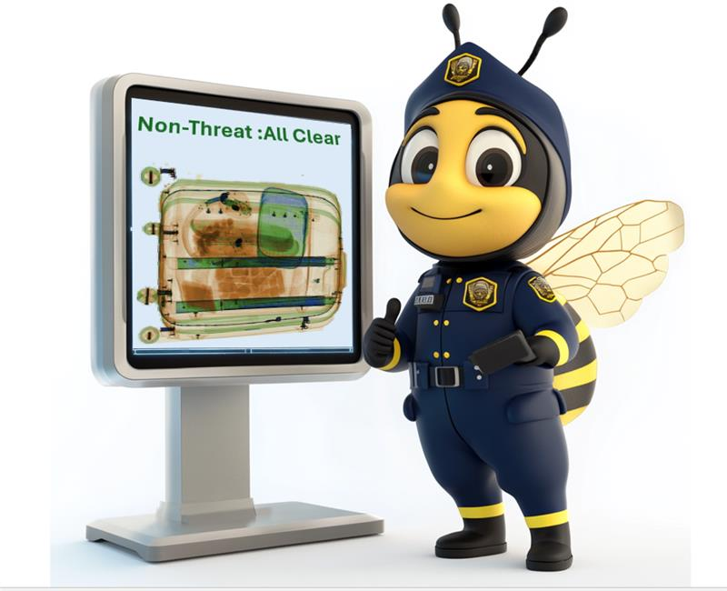

{width="150"}

# **STING-BEE: Towards Vision-Language Model for Real-World X-ray Baggage Security Inspection**

**Divya Velayudhan¹, Abdelfatah Ahmed¹*, Mohamad Alansari¹*, Neha Gour¹, Abderaouf Behouch¹,**  
**Taimur Hassan², Syed Talal Wasim³, Nabil Maalej¹, Muzammal Naseer¹, Juergen Gall³,**  
**Mohammed Bennamoun⁴, Ernesto Damiani¹, Naoufel Werghi¹**  

¹ Khalifa University of Science and Technology  
² Abu Dhabi University  
³ University of Bonn  
⁴ The University of Western Australia  

  
  
  

---

## **STING-BEE Overview**  

**STING-BEE** is the first **domain-aware visual AI assistant** for X-ray baggage security screening. It is trained on **STCray**, the first multimodal X-ray baggage security dataset, comprising **46,642 image-caption paired scans** spanning **21 threat categories**, including **novel threats** such as **Improvised Explosive Devices (IEDs)** and **3D-printed firearms**.  

STING-BEE serves as a **unified platform** for **scene comprehension, referring threat localization, visual grounding, and visual question answering (VQA)**, establishing new benchmarks for **X-ray baggage security research**.  

---

## **🏆 Contributions**  

### **1. STCray Dataset**  
We introduce **STCray**, the first X-ray baggage security dataset with **46,642 image-caption paired scans** spanning **21 categories**, including **IEDs and 3D-printed firearms**. The dataset was carefully curated following our **STING protocol** to create **realistic baggage screening scenarios**.

### **2. STING Protocol**  
To overcome the limitations of **generic vision-language models (VLMs)** in X-ray baggage analysis, we developed the **Strategic Threat ConcealING (STING) Protocol**. This **systematically varies threat positioning, angular placement, and occlusion levels**, ensuring robust training data for security applications.

### **3. STING-BEE Model**  
We introduce **STING-BEE**, a **domain-aware vision-language model** trained on our instruction-following dataset derived from **STCray**. STING-BEE excels in:  

- **Scene Comprehension**  
- **Referring Threat Localization**  
- **Visual Grounding**  
- **Visual Question Answering (VQA)**  

It establishes **new baselines** for **multimodal learning in X-ray baggage security**.  

---

## **📄 Citation**  

If you use **STING-BEE** in your research, please cite our work:  

